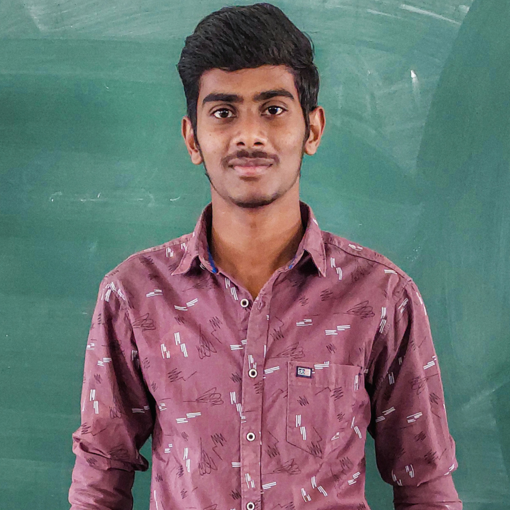

# 👋 Hello, I'm Your Name!

  

I'm a passionate developer with a love for creating amazing things. Here you'll find a glimpse into my world of coding and creativity.

## 🚀 Skills

- **Web Development:** HTML, CSS, JavaScript, React
- **Backend:** Node.js, Express.js
- **Database:** MongoDB, MySQL
- **Tools:** Git, VS Code, Docker

## 💼 Featured Projects

- [Project 1](https://github.com/yourname/project1): Brief description
- [Project 2](https://github.com/yourname/project2): Brief description
- [Project 3](https://github.com/yourname/project3): Brief description

## 📊 Skills Progress

- **JavaScript:** 85%
- **React:** 80%
- **Node.js:** 75%
- **CSS:** 90%
- **MongoDB:** 70%

<!-- Add internal CSS styles -->

## 📈 GitHub Activity

  

## 📝 Latest Blog Posts

<!-- BLOG-POST-LIST:START -->
<!-- BLOG-POST-LIST:END -->

<!-- Additional sections and badges can be added as needed -->
